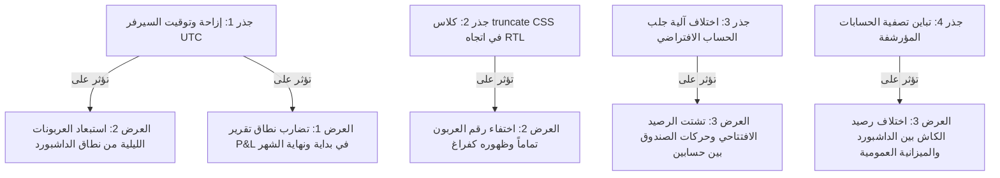

# تقرير التحليل المالي وتشخيص الأخطاء الجذري لـ Zman App

يحتوي هذا التقرير على تحليل شامل ومفصل للأعراض المالية الثلاثة المكتشفة في لوحة القيادة والتقارير بعد الكومت `0a1b1e9`. تم تتبع تدفق البيانات كاملاً من قاعدة البيانات واستعلامات SQL وإجراءات السيرفر (Server Actions) وحتى مكونات واجهة المستخدم (UI)، وتوثيق كل ملاحظة بموقعها الدقيق في المستودع (`file:line`).

---

## 📋 مصفوفة تطابق البيانات عبر المصادر المختلفة
يوضح الجدول التالي كيفية احتساب وتطابق الأرقام المالية بين شاشات التطبيق المختلفة:

| الحقل المالي | بطاقة الداشبورد (Dashboard Card) | مخطط التدفق (Financial Chart) | تقرير الأرباح والخسائر (P&L) | الميزانية العمومية (Balance Sheet) | الحالة والنتيجة |
| :--- | :--- | :--- | :--- | :--- | :--- |
| **المبيعات (Sales)** | تعتمد على جدول `sale` محددة بالنطاق الزمني للداشبورد (شامل حدي البداية والنهاية). | تعتمد على جدول `sale` بالنطاق الزمني، ولكنها معرضة لإزاحة الأيام وسقوط آخر يوم بسبب فوارق التوقيت في التنسيق البرمجي. | تعتمد على جدول `sale` ولكن باستعلام مفتوح بدون حد أقصى للتاريخ (`date >= start` فقط). | لا يوجد (يتم حساب النقد المستلم من المبيعات والعربونات بدلاً منها). | **متضاربة** (بسبب تباين شروط التاريخ والتوقيت بين الاستعلامات والـ UI). |
| **العربونات (Deposits)** | تجمع حقل `depositCents` للطلبات غير الملغاة (بما فيها المستلمة) المسجلة ضمن النطاق الزمني. | لا تعرض بشكل مستقل. | لا تعرض بشكل مستقل. | تجمع `depositCents` للطلبات غير المستلمة وغير الملغاة فقط حتى تاريخ محدد. | **متضاربة** (بسبب اختلاف فلترة حالة الطلب `delivered` والنطاق الزمني). |
| **رصيد الكاش (Cash)** | يجمع أرصدة الحسابات النقدية الحالية المستمرة (التراكمية) مع **استبعاد** الحسابات مؤرشفة. | لا يعرض بشكل مستقل. | لا يعرض بشكل مستقل. | يجمع أرصدة الحسابات النقدية التراكمية حتى تاريخ التقرير مع **تضمين** الحسابات المؤرشفة. | **متضاربة** (بسبب استبعاد الحسابات المؤرشفة في الداشبورد وتضمينها في الميزانية). |
| **رصيد البنك (Bank)** | يجمع أرصدة الحسابات البنكية الحالية المستمرة (التراكمية) مع **استبعاد** الحسابات مؤرشفة. | لا يعرض بشكل مستقل. | لا يعرض بشكل مستقل. | يجمع أرصدة الحسابات البنكية التراكمية حتى تاريخ التقرير مع **تضمين** الحسابات المؤرشفة. | **متضاربة** (بسبب تباين تصفية الأرشفة وتحديد تاريخ الميزانية). |

---

## 🔍 التشخيص التفصيلي للأعراض الثلاثة

### 1️⃣ رقم المبيعات في بطاقة الداشبورد خاطئ
* **الرقم المعروض**: يمثل مجموع مبيعات الفترة المحددة بالداشبورد بناءً على تاريخ التحويل الفعلي.
* **سلسلة البيانات**:
  1. **قاعدة البيانات**: حقل `amountCents` بجدول `sale` (نوع العمود `integer`). [src/features/finance/db.ts:104](file:///c:/Users/Qaysk/OneDrive/Desktop/Zman%20New/artifacts/zman-app/src/features/finance/db.ts#L104)
  2. **الاستعلام**: دالة `getFinancialSummary` تجمع العمود بشرط `sale.date >= startDate` و `sale.date <= endDate`. [src/features/dashboard/queries.ts:30-41](file:///c:/Users/Qaysk/OneDrive/Desktop/Zman%20New/artifacts/zman-app/src/features/dashboard/queries.ts#L30-L41)
  3. **الـ hook**: الـ hook المالي `useFinancialSummary`. [src/features/dashboard/hooks.ts:27-33](file:///c:/Users/Qaysk/OneDrive/Desktop/Zman%20New/artifacts/zman-app/src/features/dashboard/hooks.ts#L27-L33)
  4. **العرض**: بطاقة المبيعات في لوحة القيادة. [src/features/dashboard/components/DashboardClient.tsx:430](file:///c:/Users/Qaysk/OneDrive/Desktop/Zman%20New/artifacts/zman-app/src/features/dashboard/components/DashboardClient.tsx#L430)

#### ⚖️ مقارنة الحساب (المتوقع مقابل الفعلي) ونقطة الانحراف:
* **الحساب الفعلي الكودي**: يتم احتساب الإيرادات على **أساس الاستحقاق (Accrual basis)**؛ أي عند تحويل الطلب إلى بيع (`delivered`) يتم تسجيل السعر الكامل المتفق عليه كإيراد في جدول `sale` دفعة واحدة في تاريخ التحويل. أما العربون المدفوع لطلب لم يُسلم بعد فلا يُحتسب كإيراد مبيعات إطلاقاً في هذه الشاشة (يُخزن فقط كحركة صندوق).
* **الانحراف وتوقع المستخدم**: يتوقع المستخدم أن يرى المبيعات على **الأساس النقدي (Cash basis)**؛ بحيث يُحتسب العربون كإيراد مبيعات فور استلامه نقداً، ويُحتسب المتبقي كإيراد عند استلامه لاحقاً.
* **نقاط الانحراف البرمجية**:
  * **تاريخ المبيعات المحولة**: دالة `convertOrderToSale` تسجل تاريخ البيع باستخدام التوقيت الحالي لعملية الضغط على الزر `getAmmanDate()` [src/features/finance/actions.ts:1027-1031](file:///c:/Users/Qaysk/OneDrive/Desktop/Zman%20New/artifacts/zman-app/src/features/finance/actions.ts#L1027-L1031)، مما يرحل المبيعات لفترة محاسبية مختلفة تماماً إذا قام المستخدم بتوصيل طلب في شهر ما وضغط الزر في شهر آخر.
  * **تصفية تاريخ التقارير**: دالة `buildDateCondition` بالتقارير [src/features/reports/actions.ts:18-38](file:///c:/Users/Qaysk/OneDrive/Desktop/Zman%20New/artifacts/zman-app/src/features/reports/actions.ts#L18-L38) تفقد شرط الحد الأقصى للتاريخ (`date <= end`) في الفلاتر الزمنية، مما يجعل أي عملية مدخلة بتاريخ مستقبلي أو تاريخ خاطئ تظهر بالتقارير وتختفي من الداشبورد.

---

### 2️⃣ العربون يُذكر بلا رقم (فراغ أو صفر) أسفل بطاقة المبيعات
* **الرقم المعروض**: نص "يشمل طلبات بعربون:" يظهر فارغاً أو متبوعاً بنص مقصوص أو بدون قيمة رقمية واضحة.
* **سلسلة البيانات**:
  1. **قاعدة البيانات**: حقل `depositCents` بجدول `order`. [src/features/orders/db.ts:29](file:///c:/Users/Qaysk/OneDrive/Desktop/Zman%20New/artifacts/zman-app/src/features/orders/db.ts#L29)
  2. **الاستعلام**: دالة `getDashboardStats` تجمع قيم `order.depositCents` للطلبات غير الملغاة. [src/features/dashboard/queries.ts:271-283](file:///c:/Users/Qaysk/OneDrive/Desktop/Zman%20New/artifacts/zman-app/src/features/dashboard/queries.ts#L271-L283)
  3. **الـ hook**: الـ hook المالي `useDashboardStats`. [src/features/dashboard/hooks.ts:50-56](file:///c:/Users/Qaysk/OneDrive/Desktop/Zman%20New/artifacts/zman-app/src/features/dashboard/hooks.ts#L50-L56)
  4. **العرض**: بطاقة المبيعات (النص التوضيحي السفلي). [src/features/dashboard/components/DashboardClient.tsx:435-442](file:///c:/Users/Qaysk/OneDrive/Desktop/Zman%20New/artifacts/zman-app/src/features/dashboard/components/DashboardClient.tsx#L435-L442)

#### ⚖️ مقارنة الحساب ونقطة الانحراف الجذري:
1. **السبب الجذري الأساسي (تجميلي وتصميمي حرج - RTL Ellipsis Clip)**:
   النص مكتوب باللغة العربية وموجه بنظام اليمين إلى اليسار (RTL). يبدأ السطر بـ `"يشمل طلبات بعربون: "` وينتهي بالرقم المنسق بـ `<AmountText>`.
   تم تعيين الكلاس `truncate` على حاوية الـ `span` [src/features/dashboard/components/DashboardClient.tsx:437](file:///c:/Users/Qaysk/OneDrive/Desktop/Zman%20New/artifacts/zman-app/src/features/dashboard/components/DashboardClient.tsx#L437). في شاشات العرض العادية والضيقة (بسبب تقسيم الداشبورد إلى 5 أعمدة)، لا تتسع البطاقة للنص الطويل. نظراً لاتجاه الـ RTL، يقوم المتصفح بقص النص من أقصى اليسار (وهي نهاية النص التي تحتوي على الرقم المالي والعملة)، ويستبدلها بالنقاط الثلاث `...` أو يخفيها تماماً، ليظهر النص للمالك بدون رقم!
2. **إزاحة المنطقة الزمنية في قاعدة البيانات**:
   استعلام `getDashboardStats` يعتمد على تصفية التاريخ باستخدام:
   `sql`coalesce(${order.depositDate}, ${order.createdAt})::date` [src/features/dashboard/queries.ts:280-281](file:///c:/Users/Qaysk/OneDrive/Desktop/Zman%20New/artifacts/zman-app/src/features/dashboard/queries.ts#L280-L281).
   بما أن `order.createdAt` هو طابع زمني بتوقيت زمني محدد (with timezone)، فإن عملية تحويله إلى تاريخ `::date` داخل محرك PostgreSQL تتم باستخدام التوقيت المحلي للسيرفر (والذي غالباً ما يكون UTC في السحابة). هذا يؤدي إلى إزاحة الطلبات المدخلة ليلاً (بين 12:00 AM و 3:00 AM بتوقيت عمان) لليوم السابق، مما يستبعد قيمتها تماماً من النطاق الزمني المختار للداشبورد.
3. **تضمين العربونات المستلمة محاسبياً**:
   الاستعلام يفلتر فقط بـ `order.status <> 'cancelled'`، مما يعني احتساب عربونات الطلبات التي تم تسليمها وتوصيلها بالفعل (`delivered`). محاسبياً، بمجرد توصيل الطلب وتحويله لبيع، يتم إغلاق العربون وإضافته للإيراد الكامل؛ لذا فإن إظهاره تحت مسمى "يشمل طلبات بعربون" للطلبات المستلمة محاسبياً يعتبر تضارباً إضافياً، لأن التوضيح يشير إلى الطلبات غير المسلمة فقط.

---

### 3️⃣ رصيد الكاش (الصندوق) ورصيد البنك خاطئان
* **الرقم المعروض**: يمثل مجموع الأرصدة التراكمية الحالية للصناديق والحسابات البنكية.
* **سلسلة البيانات**:
  1. **قاعدة البيانات**: جدول `account` [src/features/finance/db.ts:186](file:///c:/Users/Qaysk/OneDrive/Desktop/Zman%20New/artifacts/zman-app/src/features/finance/db.ts#L186) وجدول الحركات المالية `cash_movement`. [src/features/finance/db.ts:220](file:///c:/Users/Qaysk/OneDrive/Desktop/Zman%20New/artifacts/zman-app/src/features/finance/db.ts#L220)
  2. **الاستعلام**: دالة `getAccountBalances` تجمع الحركات `in` وتطرح منها الحركات `out` لكل حساب. [src/features/finance/actions.ts:1454](file:///c:/Users/Qaysk/OneDrive/Desktop/Zman%20New/artifacts/zman-app/src/features/finance/actions.ts#L1454)
  3. **الـ hook**: الـ hook المالي `useAccountBalances`. [src/features/dashboard/hooks.ts:65](file:///c:/Users/Qaysk/OneDrive/Desktop/Zman%20New/artifacts/zman-app/src/features/dashboard/hooks.ts#L65)
  4. **العرض**: تجميع أرصدة النقدية والبنك في لوحة القيادة. [src/features/dashboard/components/DashboardClient.tsx:216-221](file:///c:/Users/Qaysk/OneDrive/Desktop/Zman%20New/artifacts/zman-app/src/features/dashboard/components/DashboardClient.tsx#L216-L221)

#### ⚖️ مقارنة الحساب ونقطة الانحراف الجذري:
1. **تشتت الأرصدة بسبب خلل ربط الحساب الافتراضي (Default Account Reference Mismatch)**:
   * عند إدخال الرصيد الافتتاحي عبر صفحة الإعداد الأولي، تقوم دالة `saveOpeningBalance` بالبحث عن **أول حساب كاش متاح** في الجدول لتحديثه [src/features/finance/actions.ts:1778-1782](file:///c:/Users/Qaysk/OneDrive/Desktop/Zman%20New/artifacts/zman-app/src/features/finance/actions.ts#L1778-L1782).
   * بالمقابل، عند تسجيل أي حركة تشغيلية (مثل مبيعات أو مصاريف)، يتم استدعاء دالة `getOrCreateDefaultCashAccount` التي تبحث عن حساب مخصص يحمل اسم `"الصندوق الرئيسي"` حصراً [src/features/finance/actions.ts:53-58](file:///c:/Users/Qaysk/OneDrive/Desktop/Zman%20New/artifacts/zman-app/src/features/finance/actions.ts#L53-L58).
   * **النتيجة**: إذا كان المستخدم قد أنشأ حساب كاش يدوياً باسم آخر قبل إدخال الرصيد الافتتاحي، فسيتم توجيه الرصيد الافتتاحي (مثلاً 5000 د.أ) إلى حسابه اليدوي، بينما تتراكم حركات البيع والشراء في حساب تلقائي جديد باسم `"الصندوق الرئيسي"`. هذا يؤدي لتشتت الحركات المالية والأرصدة بين حسابين وتشويه أرقام رصيد الكاش المعروضة.
2. **تصفية الحسابات المؤرشفة (Archived Accounts Discrepancy)**:
   * لوحة القيادة تقوم بتجميع الأرصدة باستبعاد الحسابات المؤرشفة [src/features/dashboard/components/DashboardClient.tsx:217](file:///c:/Users/Qaysk/OneDrive/Desktop/Zman%20New/artifacts/zman-app/src/features/dashboard/components/DashboardClient.tsx#L217).
   * بينما تقرير الميزانية العمومية `getFinancialPosition` يقوم بتجميع الأرصدة لكافة الحسابات في قاعدة البيانات **دون استبعاد المؤرشف منها** [src/features/reports/actions.ts:471-479](file:///c:/Users/Qaysk/OneDrive/Desktop/Zman New/artifacts/zman-app/src/features/reports/actions.ts#L471-L479). في حال وجود حساب مؤرشف يحتوي على رصيد سابق، يظهر تباين كبير بين رصيد الداشبورد ورصيد الميزانية.
3. **حساب الرصيد الافتتاحي (هل يُحسب مرتين؟)**:
   * **لا يوجد ازدواج أو نقص محاسبي في الاستعلام**: عند تعيين الرصيد الافتتاحي، يتم إدراج حركة صندوق بنوع `sourceType = 'opening'` [src/features/finance/actions.ts:1876-1883](file:///c:/Users/Qaysk/OneDrive/Desktop/Zman%20New/artifacts/zman-app/src/features/finance/actions.ts#L1876-L1883). دالة `getAccountBalances` تقوم فقط بجمع حركات الصندوق `in - out` [src/features/finance/actions.ts:1495](file:///c:/Users/Qaysk/OneDrive/Desktop/Zman%20New/artifacts/zman-app/src/features/finance/actions.ts#L1495) وتتجنب جمع الحقل `openingBalanceCents` المخزن بجدول الحسابات لمنع الازدواج. العملية البرمجية هنا صحيحة، لكن الخطأ ناتج فقط عن تشتت الحركات بين حسابين (نقطة 1) والأرشفة (نقطة 2).

---

## 🔗 خريطة ترابط الأخطاء والجذور المشتركة

توضح شبكة الترابطات التالية كيف تؤثر الجذور البرمجية المشتركة على ظهور الأعراض المالية المتعددة في نفس الوقت:

---

## 🔍 عيوب إضافية مكتشفة (أثناء تتبع الكود)

### 🚨 عيب إضافي 1: خلل إزاحة التوقيت في المخطط المالي (FinancialChart)
* **الموقع**: [src/features/dashboard/components/FinancialChart.tsx:28-31](file:///c:/Users/Qaysk/OneDrive/Desktop/Zman%20New/artifacts/zman-app/src/features/dashboard/components/FinancialChart.tsx#L28-L31)
* **التفاصيل**: يقوم المخطط ببناء خريطة الأيام البرمجية كالتالي:
  `const start = new Date(startDate);`
  ثم يقوم بتهيئة المفاتيح بالصيغة المحلية للمتصفح:
  `d.toLocaleDateString("en-CA")`
  *بما أن التاريخ الممرر يتم تفسيره كمنتصف الليل بتوقيت UTC، فإن المتصفحات في المناطق الزمنية المتأخرة عن UTC (مثل أمريكا) ستقوم بترحيل تاريخ البداية إلى اليوم السابق (مثلاً 2026-06-30 بدلاً من 2026-07-01). هذا يزيح المفاتيح ويؤدي إلى إغفال مبيعات اليوم الأخير من النطاق تماماً وعدم مطابقتها، فيظهر مجموع المخطط أقل من بطاقة المبيعات.*

### 🚨 عيب إضافي 2: توازن الميزانية الوهمي والتغاضي عن فوارق رأس المال
* **الموقع**: [src/features/reports/actions.ts:620-623](file:///c:/Users/Qaysk/OneDrive/Desktop/Zman New/artifacts/zman-app/src/features/reports/actions.ts#L620-L623)
* **التفاصيل**: دالة `getFinancialPosition` تتفادى استخدام رأس المال المصرح به والمدخل من المستخدم (`openingCapitalCents`) في حسابات حقوق الملكية، وتقوم بدلاً من ذلك باحتساب حقوق الملكية ديناميكياً بالاعتماد على نقدية البداية الفعلية (`openingCashInEquityCents`) لضمان مرور فحص التوازن المالي وتجنب إرجاع خطأ. هذا يخفي أي أخطاء محاسبية في إدخال رأس المال والافتتاحي من قبل المالك.

### 🚨 عيب إضافي 3: غياب الحد الأقصى في فلاتر تاريخ التقارير
* **الموقع**: [src/features/reports/actions.ts:26](file:///c:/Users/Qaysk/OneDrive/Desktop/Zman New/artifacts/zman-app/src/features/reports/actions.ts#L26) و [src/features/reports/actions.ts:35](file:///c:/Users/Qaysk/OneDrive/Desktop/Zman New/artifacts/zman-app/src/features/reports/actions.ts#L35)
* **التفاصيل**: دالة `buildDateCondition` بالتقارير تكتفي بفلتر البداية `date >= start`. إذا قام المستخدم بتسجيل أي حركة مستقبلية بالخطأ، ستدخل في تقرير الشهر الحالي، بينما تستبعدها لوحة القيادة التي تحدد السقف بـ `date <= end`؛ مما يسبب اختلاف الأرقام.

---

## 📈 تصنيف الخطورة وتأثير العيوب المكتشفة

| العرض / العيب المكتشف | تصنيف الخطورة | الأثر على القرارات المالية والتشغيل |
| :--- | :--- | :--- |
| **تشتت حركات الكاش بين حسابين** | **حرج جداً** | يشوه رصيد الخزينة الفعلي بالكامل ويظهر حساب الصندوق الرئيسي فارغاً أو بأرقام مغلوطة تختلف عن الحقيقة. |
| **إغفال شرط الأرشفة في الميزانية** | **متوسط** | يسبب فوارق مالية وتضارباً غير مفسر بين رصيد الصندوق بالداشبورد وتقرير الميزانية العمومية. |
| **قص نص العربون CSS Truncation** | **تجميلي (ولكن مربك)** | يمنع المالك من قراءة قيمة العربونات النشطة في الداشبورد مما يجعله يظن أن قيمتها صفر أو لم تسجل. |
| **إزاحة توقيت الخادم وحذف اليوم الأخير** | **حرج** | يغير من توزيع الإيرادات اليومية والشهرية ويسقط مبيعات اليوم الأخير من الرسم البياني التراكمي. |
| **غياب السقف التاريخي في التقارير** | **حرج** | يدمج إيرادات فترات لاحقة أو مستقبلية بالخطأ في تقارير الفترات الحالية المحددة. |

---

## 💡 الإصلاحات المقترحة (خطط معالجة برمجية)

### 🛠️ المقترح 1: حل مشكلة رقم المبيعات والحد التاريخي في التقارير
* **الملف المستهدف**: `src/features/reports/actions.ts:18-38` (دالة `buildDateCondition`).
* **المنهج المقترح**: تحديث منطق بناء التاريخ ليقبل تاريخ النهاية كعامل تصفية إضافي ويضيف حداً أقصى للاستعلام ليتطابق مع الداشبورد:
  * حساب تاريخ نهاية الشهر الحالي ديناميكياً عند اختيار فلتر `"month"`.
  * إضافة شرط `sql`${dateField} <= ${end}` إلى مصفوفة الشروط لضمان عدم سحب أي بيانات مستقبلية.
* **تاريخ البيع للطلب**: تعديل دالة `convertOrderToSale` [src/features/finance/actions.ts:1027-1031](file:///c:/Users/Qaysk/OneDrive/Desktop/Zman%20New/artifacts/zman-app/src/features/finance/actions.ts#L1027-L1031) لتسجل المبيعات بتاريخ تسليم الطلب الفعلي `orderRow.deliveryDate` أو تاريخ استلامه `orderRow.receivedDate` بدلاً من التاريخ الحالي للضغط على الزر، مع إتاحة خيار للمستخدم لتأكيد تاريخ البيع.

### 🛠️ المقترح 2: حل مشكلة اختفاء رقم العربون (RTL Clipping)
* **الملف المستهدف**: `src/features/dashboard/components/DashboardClient.tsx:437`.
* **المنهج المقترح**: إزالة الكلاس `truncate` من حاوية النص `span` لضمان عدم قيام المتصفح بقص الرقم المالي في البيئات ذات الاتجاه RTL، واستخدام نمط مرن مثل `flex flex-wrap` لتوزيع التسمية والقيمة الرقمية بشكل مريح على أسطر متعددة عند ضيق المساحة.

### 🛠️ المقترح 3: حل مشكلة تشتت الصندوق وأرصدة الكاش والبنك
* **الملف المستهدف**: `src/features/finance/actions.ts:1778` (دالة `saveOpeningBalance`).
* **المنهج المقترح**: تعديل منطق استعلام الصندوق الافتراضي للتحقق من الاسم المطابق للصندوق الرئيسي `"الصندوق الرئيسي"` والنوع `"cash"` تماماً كما تفعل دالة التشغيل `getOrCreateDefaultCashAccount`، بدلاً من أخذ أول حساب كاش في القائمة بصورة عمياء.
* **لحل مشكلة الأرشفة**: تحديث الاستعلامات الخاصة بـ `getFinancialPosition` في `src/features/reports/actions.ts:471-479` لتشمل فلتر `eq(account.isArchived, false)` لتتطابق القيود تماماً مع منطق الداشبورد.

### 🛠️ المقترح 4: حل مشكلة إزاحة توقيت المخطط المالي
* **الملف المستهدف**: `src/features/dashboard/components/FinancialChart.tsx:28-31`.
* **المنهج المقترح**: تجنب الاعتماد على `d.toLocaleDateString("en-CA")` مباشرة عند تدوير الأيام، واستخراج قيم السنة والشهر واليوم بشكل صريح أو استخدام منسق تاريخ مخصص ثابت لمنع المتصفح من استخدام إزاحة المنطقة الزمنية المحلية للمستخدم وتشويه مفاتيح المخطط.
